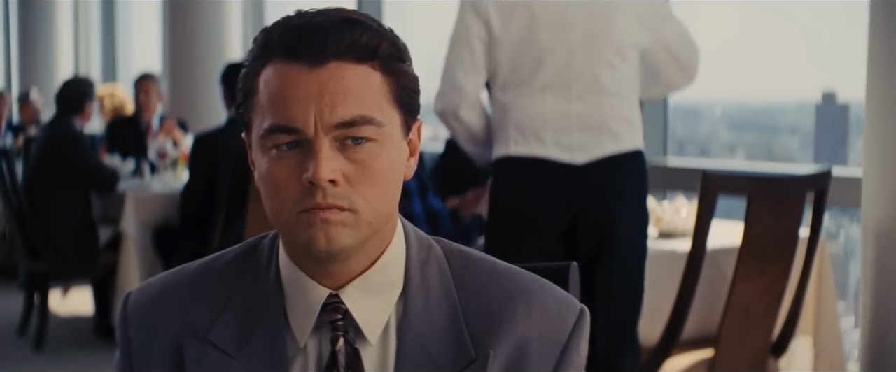
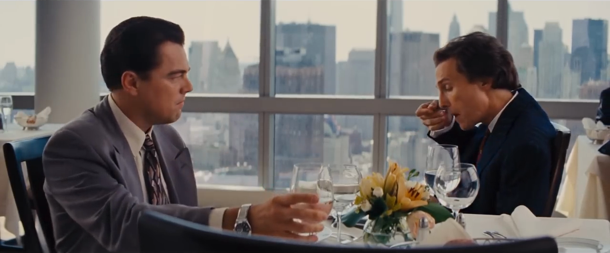
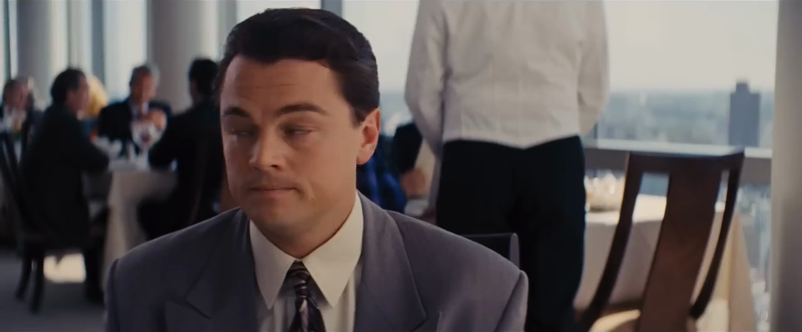

# Projector Correction Project
#### Kincannon Wilson, James Wedum, Nithin Weerasinghe

### Presentation Slides
[View the presentation slides here](./Presentation.pdf)

### Introduction

Problem: Physical projection image quality is highly dependent on environmental factors. These factors include, but are not limited to: ambient lighting, surface color and texture, vibrations and impacts, and physical placement. These factors cannot always be presumed to be static in the environment; for example, significant scene changes can affect global illumination, resulting in color and luminosity perturbations. The project aims to develop and evaluate methodologies for improving the quality of projected images by dynamically adapting to environmental factors to create an application capable of intelligently enhancing projected image quality.

Current projectors utilize basic color correction algorithms and smooth screens to enhance image quality, but they don't effectively address changing environmental conditions like surface texture or dynamic factors such as moving screens or shifting lighting. Past research often relies on specialized hardware or algorithms, limiting accessibility. Our project proposes a dynamic correction system that adapts to environmental changes using only a camera, projector, and computer connected via HDMI, eliminating the need for specialized hardware like GPUs or constant user input.

## Setup

Python version: 3.10.12 (managed with pyenv)

```shell
python -m venv venv
source venv/bin/activate
pip install -r requirements.txt
```

Verify installation and ensure pytest uses the correct interpreter:

```shell
python -m pytest
```

## Methodology

We propose a reactive-adaptive system that primarily functions using multiple feedback loops in cascade, complemented by a pseudo-feed-forward component. The feed-forward component consists of two functions: the calculation and application of a homography matrix to correct for sheer, and a low-pass filter for determining a color delta. We employ the pseudo-feed-forward mechanism to control optical blur and focus adjustment. This mechanism initially operates based on visual feedback followed by feedback from an encoder to operate a PD (Proportional-Derivative) controller, achieving a steady state after settling. Once in this state, it does not react again unless reactivation is specified by the user, allowing the mechanism to function predominantly as a feed-forward component throughout most of the operation cycle.


The color delta application utilizes a low-pass average filter on a buffer of per-frame pixel-wise color deltas. This is calculated from individual captured frames. We expect some level of ghosting, based on the buffer size. That is, there may be an after-image from portions of the scene that are in-frame for some period of time based on parameters such as buffer size and capture rate. Character and scene transitions are our high-frequency portion of the data. Given some window, a number on non-static elements are expected in the image due to motion and scene change. The low-pass filter seeks to attenuate this information by averaging together many distinctly different frame deltas. This should result in primarily low-frequency information regarding color and luminosity to be retained in the filter, such as those resulting from the physical characteristics of the projection space. This method of smoothing should prevent flickering resulting from frame-by-frame color and luminosity correction.

## Limitations

There are multiple limitations with the project. First, we limited the number of frames we used in our low-pass filter. This reduced its effectiveness by shrinking the time scale being measured. That is, information that would be high-frequency on a longer time scale, such as scene-dependent static elements, may be treated as low-frequency information because they may be present in all or most of a shorter buffer. This is evident in examples with ghosting (residue from previous frames). 


Exploration of more sophisticated filtering techniques may have proven fruitful, as well as implementing an adaptive buffer size based on screen dynamics. Rather than attempting to correct luminosity and color simultaneously, each could have been corrected separately through additional methods. Due to complexity arising from the control system-based approach, we included an iterative method for color correction which showed much better results when compared to a small buffer.

## Data

For testing purposes, we used 75 frames from *The Wolf of Wall Street (2013)*. Here are a few sample frames from the data set.

  

## Evaluation Metrics

We propose a single primary evaluation metric for our experiments, the normalized pixel-wise MAE (Mean Absolute Error). The value is the normalized distance between a recorded image and the actual image produced on the computer. We calculate this metric by taking the absolute difference between the two images’ intensities and dividing by the maximum possible difference between two images of that size to obtain a result in the range of 0 to 1, inclusive; with a value of 1 suggesting maximum dissimilarity and a value of 0 corresponding to an exact match.

Upon post-mortem review, we recognized that the single metric may not have been fully sufficient. One weakness is that it is insensitive to image artifacts that would be very noticeable to the average human viewer, leading to certain types of corruption not being properly accounted for. Additionally, prior work often utilized user studies to corroborate their results by having participants compare the resulting projection against a control or other techniques. Given our time and resource constraints, we were not able to conduct such trials.

## Discussion of quantitative results

[This folder](./results) contains the results of our experiments for the project. We ran an initial test with the projector system with a blue screen that you can see at blue_screen_correction.png. We ran a test on how well the system would respond to an irregular surface in front of the target projection surface at diff_test_results. Finally, you can see the graph evaluating the distance metrics generated by the various methods we employed below.


The iterative approach provided the best results based on our evaluation metric. However, upon inspection of the outputs, it is clear that the results contain significant visual artifacts. This suggests that alternative and/or additional evaluation metrics should be considered moving forward, including perceptual quality metrics such as Structural Similarity Index (SSI), Peak Signal-to-Noise Ratio (PSNR), or Visual Information Fidelity (VIF); and temporal consitency metrics such as Temporal Structural Similarity Index (TSSI) or Temporal Average Gradient (TAG).

## Demos

Here is a timelapse of the iterative experiment. More demos can be viewed in the GitHub repo (link at the top of the page).


Our correction method on a static blue screen:


## References

The Wolf of Wall Street (2013)

Detecting Good Surface for Improvisatory Visual Projection: https://ieeexplore.ieee.org/abstract/document/8241589

A real-time interactive system of surface reconstruction and dynamic projection mapping with RGB-depth sensor and projector: https://journals.sagepub.com/doi/full/10.1177/1550147718790853

Perceptual visual quality metrics: A survey: https://www.sciencedirect.com/science/article/abs/pii/S1047320311000204

Real Time Adaptive Radiometric Compensation: https://src.acm.org/binaries/content/assets/src/2007/anselm-grundhoefer.pdf

